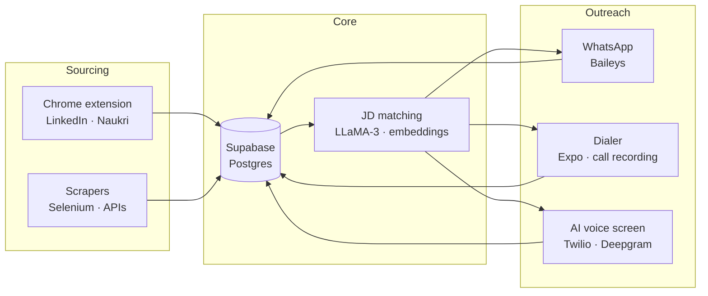

<picture>
  <source media="(prefers-color-scheme: dark)" srcset="https://raw.githubusercontent.com/Sudhanshu-SM/Sudhanshu-SM/main/banner-dark.svg">
  <source media="(prefers-color-scheme: light)" srcset="https://raw.githubusercontent.com/Sudhanshu-SM/Sudhanshu-SM/main/banner-light.svg">
  
</picture>

  
  
  
  
  &nbsp;
  
  

---

## whoami

I build products end to end — problem, spec, architecture, and the code when it needs to exist today.
I'm most useful at the seam between "what should this do" and "how does it actually work at 3am."

Recruiting AI is where I do it commercially: three live products, real customers, real on-call.
Edtech, games and research are where I do it because the problem was interesting and nobody had
built the thing I wanted. The hard part was never the code — it's deciding what deserves to exist.

Metallurgical and Materials Engineering at IIT Kharagpur on paper. Almost none of the above is metallurgy.

---

## Products I run

| | What it is | Stack |
|---|---|---|
| **[Superhyre](https://www.superhyre.com)** | WhatsApp-native recruitment automation — sourcing, outreach and pipeline in one thread | Next.js · Supabase · Baileys |
| **[RekZon](https://rekzon.com)** | AI-native recruiting platform: sources candidates across the web, scores them against a JD, runs bulk WhatsApp + email outreach. Ships its own Android dialer with call recording | Vite · Node · Supabase · Expo |
| **[Magnifi](https://www.getmagnifi.com)** | Multi-tenant WhatsApp CRM. Per-org encryption at rest for message bodies and chat names | Next.js 14 · Express · Supabase |

<b>How the three fit together</b>

---

## Experience

**AI Solutions · [Superhyre](https://www.superhyre.com)** — *Dec 2025 – present*

- **AI voice agent** that calls candidates, screens them and runs interviews at **sub-second latency**. Twilio for telephony, Deepgram for STT/TTS, Gemini for the conversation, FastAPI holding it together.
- **WhatsApp CRM** — real-time WebSocket messaging, PostgreSQL, role-based access. Admins assign queries to agents, comment, and track resolution.
- **Recruitment platform** on LLaMA-3 + Google Workspace APIs — candidate scraping, resume parsing and match scoring, on Postgres via Supabase.
- **Scraping at scale** — Selenium, Pandas and OAuth 2.0 across YouTube, LinkedIn, Instagram, X and Meta Ads, exporting to Sheets.
- **n8n orchestration** for lead-gen and social-tracking pipelines, so non-engineers can run multi-step jobs without me.

**Research Intern · Reinforcement Learning · IIT Roorkee** — *Jun – Aug 2024* · Prof. Sudip Roy

- Q-learning Tic-Tac-Toe agent to a **0.75 win probability** after training and tuning.
- Monte Carlo obstacle-avoidance bot with sonar-driven direction changes.

**Research Intern · Bankruptcy Prediction · XLRI Jamshedpur** — *May – Jun 2024* · Prof. Trilochan Tripathy

- **7,000+ companies, 95 features.** SMOTE for class balance, PCA for reduction.
- Benchmarked decision trees and XGBoost; a stacking classifier won at **F1 0.9931**.

**Technical Head · Business Club, IIT Kharagpur** — *2024 – present*

- Ran the Indian Case Challenge two years running. 2026 edition: **9,700+ participants from 1,000+ institutions.**

---

## Built because I wanted it to exist

| | What it is |
|---|---|
| **[easycbse](https://github.com/Sudhanshu-SM/easycbse)** · [live](https://www.easycbse.com) | Free NCERT textbooks for every CBSE class and subject. The official portal is slow, unsearchable and serves scans one chapter at a time — this doesn't. |
| **[Project-Mahabharat](https://github.com/Sudhanshu-SM/Project-Mahabharat)** | RAG chatbot that holds a conversation in character as figures from the Mahabharata. LLaMA-3 via Groq, HuggingFace embeddings, Pinecone over 30+ ingested books, SQLite for persistent history. |
| **[GuessStupid](https://github.com/Sudhanshu-SM/GuessStupid)** | Daily multi-genre guessing game. Five hints per puzzle, vague → precise; the same five challenges worldwide, rolling at midnight UTC. |
| **[sanatan-smile](https://github.com/Sudhanshu-SM/sanatan-smile)** | Learn, memorise and chant the shlokas and bhajans of Sanātana Dharma — pronunciation, tune and meaning, with syllable-level audio alignment so the text follows the chant. |
| **[ICC-2026](https://github.com/Sudhanshu-SM/ICC-2026)** | Site for the Indian Case Challenge 2026. |

Product thinking, not just code: [sanatan-smile's revenue strategy](https://github.com/Sudhanshu-SM/sanatan-smile/blob/main/Sanatan_Smile_Revenue_Strategy.md) —
competitive read of a category with strong free incumbents, geo-tiered pricing, and why charging for
content access would fail where charging for learning outcomes won't.

---

## How I work

- **Write the spec before the code.** My repos ship with a `PLAN.md`: the problem, the options considered, and why one won. Commit history should never be the only record of a decision.
- **Ship the smallest thing that proves the bet.** The Rekzon dialer was a Kotlin app before it was an Expo app; the rewrite happened once the feature set stopped moving, not before.
- **Own the boundary.** Sourcing, scoring and outreach are three products pretending to be one. Most of my time goes to the seams between them.
- **Instrument or it didn't happen.** Sub-second latency, F1 0.9931, 9,700 participants — numbers, or it's an anecdote.
- **Build for one real user first.** Sanatan Smile started as a tool for my grandmother. easycbse started because I couldn't find my own textbooks.

---

## Toolkit

<table>
  <tr><td><b>Languages</b></td><td>
    
  </td></tr>
  <tr><td><b>AI / ML</b></td><td>
    
    &nbsp;<code>LangChain</code> <code>RAG</code> <code>Hugging Face</code> <code>Pinecone</code>
  </td></tr>
  <tr><td><b>Backend</b></td><td>
    
  </td></tr>
  <tr><td><b>Frontend</b></td><td>
    
  </td></tr>
  <tr><td><b>Mobile</b></td><td>
    
    &nbsp;<code>Expo</code> <code>EAS</code>
  </td></tr>
  <tr><td><b>Infra</b></td><td>
    
    &nbsp;<code>n8n</code>
  </td></tr>
</table>

---

## Activity

  <picture>
    <source media="(prefers-color-scheme: dark)" srcset="https://streak-stats.demolab.com?user=Sudhanshu-SM&theme=github-dark-blue&hide_border=true&border_radius=6&date_format=j%20M%5B%20Y%5D&ring=2DD4BF&fire=2DD4BF&currStreakLabel=2DD4BF">
    
  </picture>

  <picture>
    <source media="(prefers-color-scheme: dark)" srcset="https://github-readme-activity-graph.vercel.app/graph?username=Sudhanshu-SM&theme=github-compact&hide_border=true&radius=6&color=2DD4BF&line=2DD4BF&point=f0f6fc&bg_color=0d1117">
    
  </picture>

Most of what I ship lives in private repos — the graph counts those, the repo list doesn't.

---

## Recognition

- **Bronze** — Smart India Hackathon, sign language recognition (TensorFlow + OpenCV, CNN over webcam gesture capture).
- **National finalist** — Crisis Consulting Case Study Competition, SRCC Delhi.
- **Tata scholarship** — ₹75,000/year, awarded on academic merit.

---

  <b>Building out of Kharagpur.</b> 
  Working on something in recruiting, edtech or agent infrastructure? I'd like to hear about it. 
  <a href="mailto:team@superhyre.com">team@superhyre.com</a> · <a href="https://linkedin.com/in/sudhanshu-mishra-6a70a3287">LinkedIn</a>

